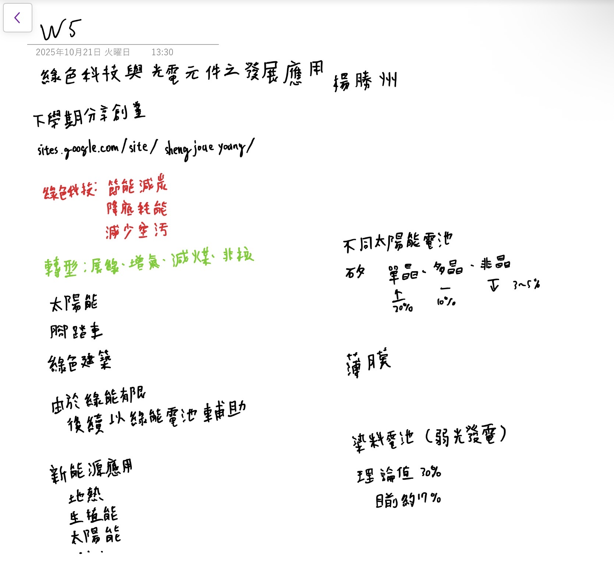
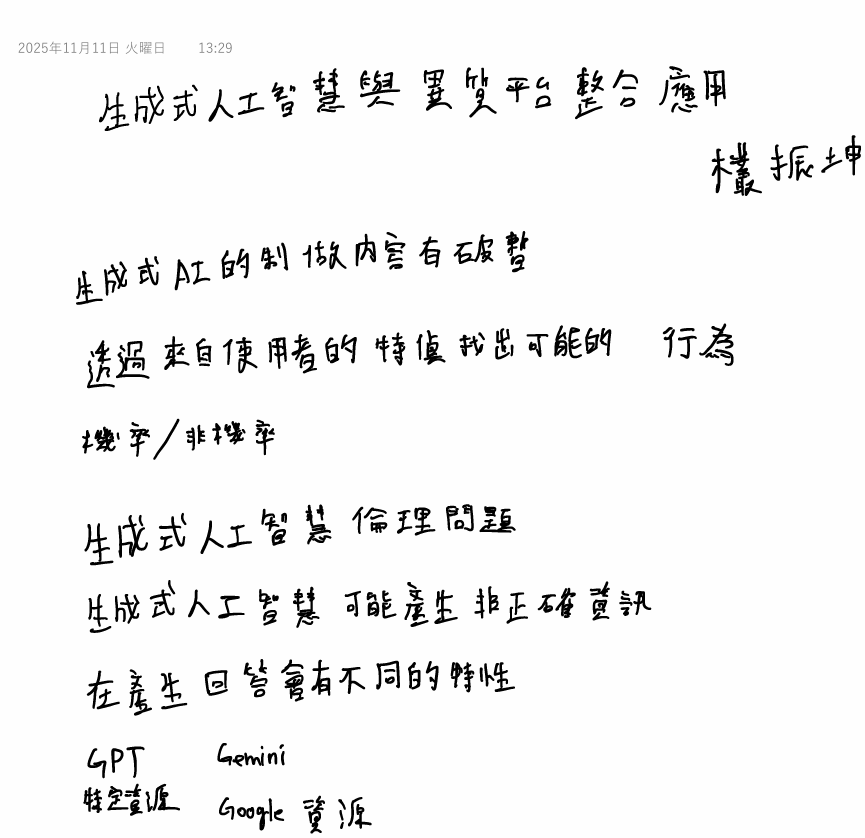
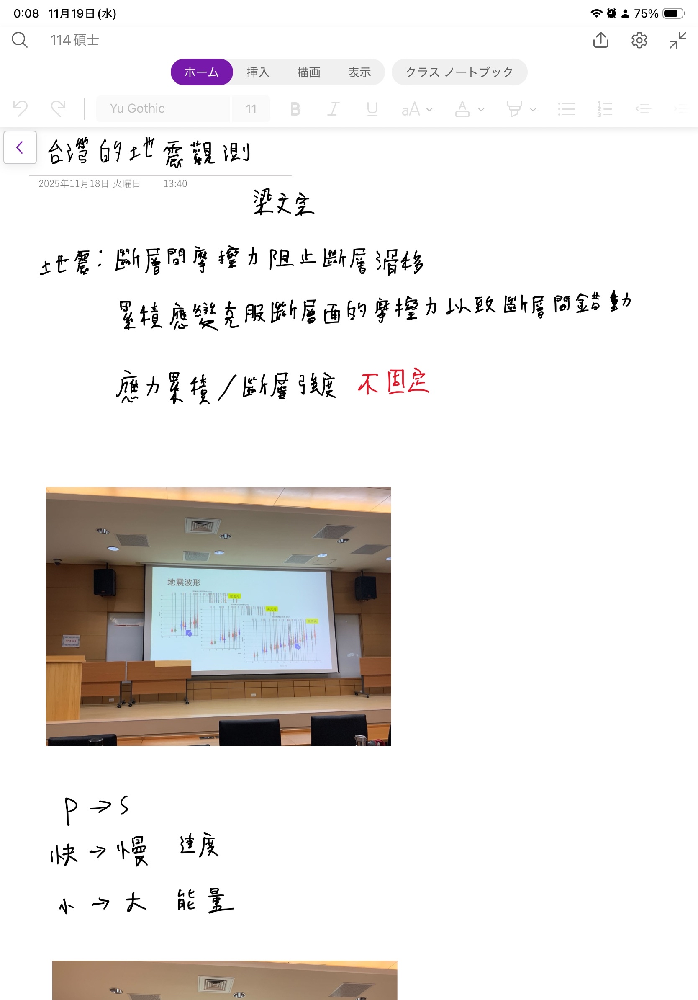
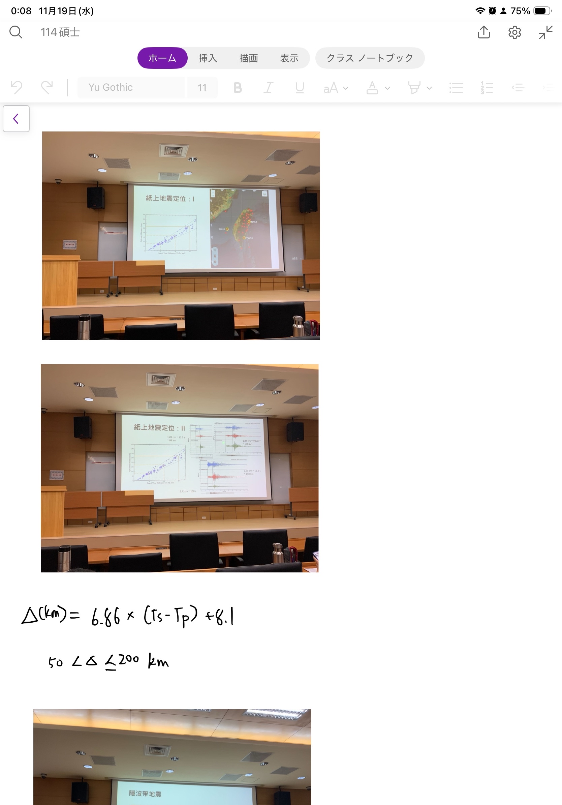
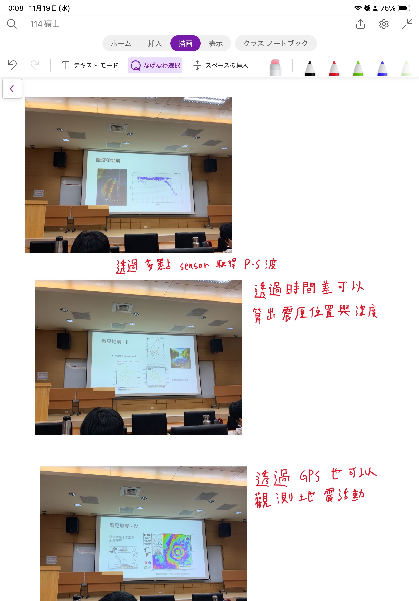
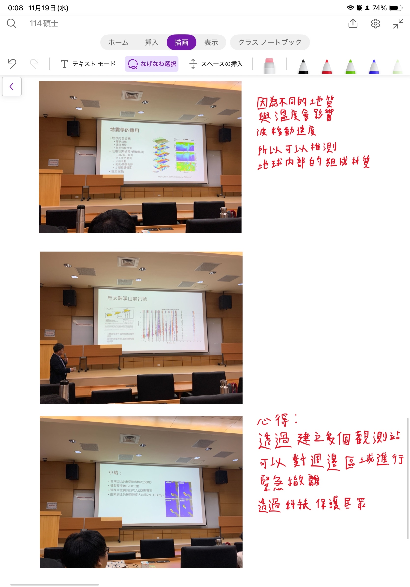

# 書報討論

### Homework 1

---
### Homework 2

---
### Homework 3

---
### Homewrok 4

---
### Homework 5

---
### Homework 6

本周內容主要在說明如何挑選不同的AI工具

針對不同的需求每個工具有不同的優勢

並且未來工作上也會有需要協做的可能性

---
### Homework 7

